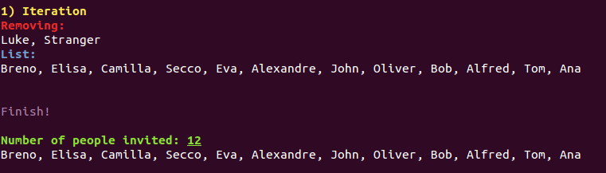

# Algorithms - Papadimitriou

## Chapter 5 - Exercise 27
> Alice wants to throw a party and is deciding whom to call. She has n people to choose from, and
she has made up a list of which pairs of these people know each other. She wants to pick as many
people as possible, subject to two constraints: at the party, each person should have at least five
other people whom they know and five other people whom they don’t know.

> Give an efficient algorithm that takes as input the list of n people and the list of pairs who know
each other and outputs the best choice of party invitees. Give the running time in terms of n.


### Solução naive

Caso Alice não soubesse como desenvolver algoritmos eficientes, ela resolveria da seguinte maneira:

1. Ela faria uma lista com todas as combinações possíveis de convidados
2. Para cada combinação, ela verificaria se os convidados atendem aos requisitos

Essa solução tem tempo de execução O(2<sup>n</sup>).

### Solução eficiente

Como a Alice sabe resolver problemas usamos algoritmos eficientes, sua solução foi:

1. Criamos um grafo com cada pessoa sendo um vértice e as arestas representando os relacionamentos
2. Computamos o grau de cada vértice no grafo
3. Verificamos se o grau de cada vértice é maior do que cinco e menor do que o número de vértices no grafo menos cinco
4. Caso não seja, o adicionamos a uma lista de vértices a serem removidos
5. Caso a lista seja vazia, paramos o algoritmo, pois a solução foi encontrada
6. Caso contrário, removemos do grafo todos os vértices dessa lista e, com eles, suas arestas. Voltamos ao passo 2

Essa solução tem tempo de execução O(n).

### Código da solução

```py
# Definimos o numero minimo de amigos e numero minimo de estranhos
# como parametros
def main(min_friends, min_strangers):
    # Lemos o grafo a partir de uma matriz de incidencia
    people, edges = read_csv('friends.csv')

    iteration = 1
    while True:
        # Pegamos as pessoas que nao atendem as restricoes, isto eh,
        # que nao possuem no minimo 5 amigos e que nao desconhecem pelo menos
        # outras 5
        people_to_remove = filter_people(people, edges, min_friends, min_strangers)
        people_to_remove = set(people_to_remove)

        # Quando nao tivermos mais ninguem para retirar da lista, paramos o algoritmo
        if len(people_to_remove) is 0:
            break

        # Removemos as pessoas que nao atendem as restricoes
        [people, edges] = remove_people(people, edges, people_to_remove)

        # Imprimimos o estado atual da lista de convidados
        print_status(people, edges, people_to_remove, iteration)

        iteration += 1

    # Imprimimos o resultado
    print_result(people)
```

```py
# Essa funcao lista as pessoas que nao atendem as retricoes de amizade minima e
# e de desconhecidos minimos
def filter_people(people, edges, minimum_number_of_friends, must_not_know_at_least):
    # Numero total de pessoas
    number_of_people = len(people)

    people_to_remove = []

    for i, person in enumerate(people):
        # Verifica quantos amigos ela tem
        edges_of_person = get_edges_of_person(people, edges, person)
        friends = len(edges_of_person)

        # Caso tenha menos amigos do que o minimo estabelecido
        if friends < minimum_number_of_friends:
            # Ela entra na lista
            people_to_remove.append(person)

        # Caso ela tenha mais amigos do que o numero total de pessoas menos
        # o minimo de desconhecidos
        if friends >= len(people) - must_not_know_at_least:
            # Ela entra na lista
            people_to_remove.append(person)

    return people_to_remove
```

```py
# Removemos as pessoas que estao na lista
def remove_people(people, edges, list):
    new_people = people[:]
    new_edges = edges[:]

    # Para cada pessoa na lista, a removemos
    for person in list:
        [new_people, new_edges] = remove_person(new_people, new_edges, person)

    # Retornamos o novo grafo
    return [new_people, new_edges]
```

```py
def remove_person(people, edges, person_name):
    new_people = people[:]
    new_edges = edges[:]

    # Pegamos o indice dessa pessoa na matriz de incidencia
    person_index = find_person_index(people, person_name)

    for i, edge in enumerate(new_edges):
        # Caso a aresta seja relacionada a pessoa
        if edge[person_index] == "1":
            # Retiramos a aresta
            new_edges.pop(i)

    # Retiramos a pessoa da lista de pessoas
    new_people.pop(person_index)

    return [new_people, new_edges]
```

### Rodando a solução

O código aceita duas entradas: o número mínimo de amigos e o número mínimo de pessoas que ela deve desconhecer. Por padrão, esses valores são ambos cinco, assim como descrito no exercício.

Esses parâmetros podem ser alterados, como mostra abaixo:

```sh
python party.py <minimum_number_of_friends> <must_not_know_at_least>
```

A cada iteração de redução da lista, o código apresenta a lista de amigos restantes. No final, é apresentada a lista de convidados, se ela existe.

A lista de pessoas e seus relacionamentos é representada no arquivo "friends.csv", que tem a forma de uma matriz de incidência.


